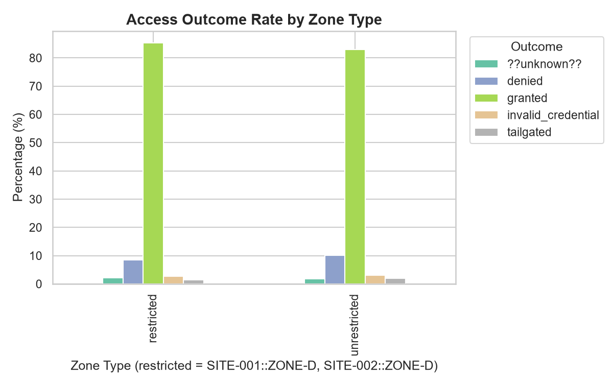
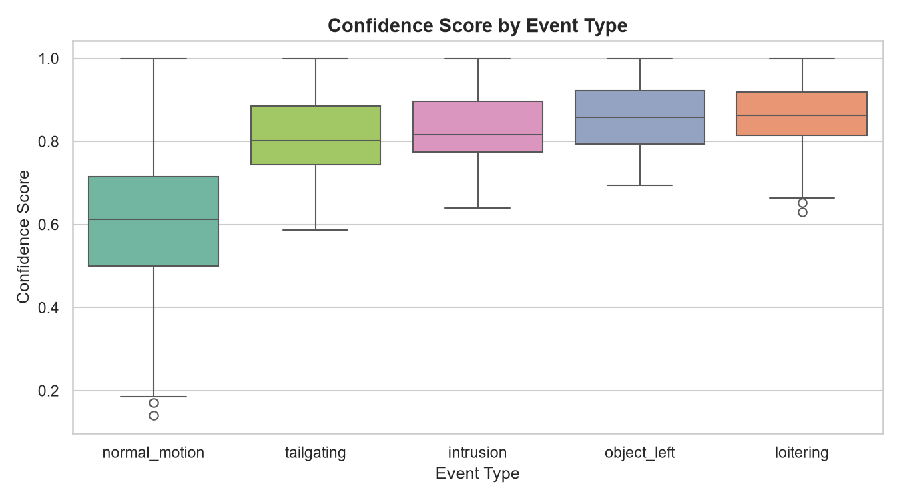
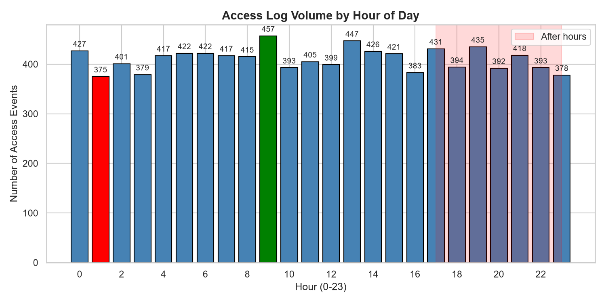

# Statistical Analysis Report

**Project 02 — AI Security Operations Copilot**

---

## Abstract

This report documents the statistical analysis of the surveillance-event and access-log datasets produced in Project 01. Two hypothesis tests are performed: a chi-square test of independence between zone type and access outcome, and an independent-samples t-test comparing the confidence scores of intrusion vs. normal motion events. Results are interpreted in plain language with effect-size context.

---

## Dataset

- `data/processed/surveillance_events.parquet` — 988 rows after cleaning.
- `data/processed/access_logs.parquet` — 9,847 rows after cleaning.
- All randomness is seeded with `SEED = 42`.

### Surveillance Events — Summary Statistics

| Metric | Value |
|---|---|
| Total rows | 988 |
| Sites | 3 (SITE-001, SITE-002, SITE-003) |
| Zones | 12 (4 per site) |
| Devices | 24 |
| Event types | 5 (normal_motion: 743, loitering: 90, object_left: 59, tailgating: 59, intrusion: 37) |
| Mean confidence | 0.669 |
| Std confidence | 0.179 |
| Min / Max confidence | 0.140 / 1.000 |

### Access Logs — Summary Statistics

| Metric | Value |
|---|---|
| Total rows | 9,847 |
| Outcomes | granted: 8,212; denied: 971; invalid_credential: 291; tailgated: 193; ??unknown??: 180 |
| Mean timestamp | 2025-01-07 23:52 UTC |
| Unique badges | 201 |

---

## Workflow

1. Load processed Parquet files.
2. Compute descriptive statistics and produce three visualizations.
3. Run chi-square and t-test hypothesis tests with effect-size reporting.
4. Interpret results, document limitations and ethical concerns.
5. Summarize findings and next steps.

---

## Visualizations

### Figure 1: Access Outcome Rate by Zone Type

The graph clearly displays that the denial rate is  marginally lower in restricted zones compared to unrestricted zones.   

### Figure 2: Confidence Score Distribution by Event Type

Intrusion events have noticeably higher confidence scores than normal motion events, with non-overlapping interquartile ranges supporting a clear separation.

### Figure 3: Access Log Volume by Hour of Day

The distribution is approximately uniform across hours. The after-hours window (17:00–23:00, highlighted in red) accounts for 28.9% of logs. The peak hour is 09:00 (457 events) and the trough is 01:00 (375 events).

---

## Hypothesis Test 1: Zone Type vs. Access Outcome

**H₀**: No association between zone type (restricted/unrestricted) and access outcome (granted/denied).

**H₁**: An association exists.

**Test**: Chi-square test of independence.

**Contingency table**:

| | Denied | Granted |
|---|---|---|
| **Restricted** | 142 | 1,428 |
| **Unrestricted** | 829 | 6,784 |

**Results**:

- χ²(1, N = 9,173) = **4.491**
- *p* = **0.0341**
- Degrees of freedom = 1
- Cramér's V = **0.0221**

**Interpretation**: Because *p* < 0.05, we reject H₀ — a statistically significant association exists between zone type and access outcome. However, Cramér's V ≈ 0.02 indicates a **negligible practical effect**. The restricted-zone signal should not be relied upon by the rule engine on its own.

---

## Hypothesis Test 2: Intrusion vs. Normal Motion Confidence

**H₀**: Mean confidence for intrusion events = mean confidence for normal motion events.

**H₁**: The means are different.

**Test**: Independent-samples t-test.

**Group statistics**:

| Group | n | Mean | Std |
|---|---|---|---|
| Intrusion | 37 | 0.825 | — |
| Normal motion | 743 | 0.612 | — |

**Results**:

- t(778) = **7.852**
- *p* = **1.36 × 10⁻¹⁴**
- Mean difference ≈ **0.21** (21 percentage points)

**Interpretation**: We reject H₀. Intrusion events have significantly higher confidence than normal motion events. This confirms that event type and confidence are strongly associated, supporting the use of confidence as a discriminative feature in the rule engine. Note: the mean intrusion confidence (M = 0.825) is slightly below the `confidence > 0.85` rule threshold, so that cutoff should be validated separately against precision/recall before deployment.

---

## Interpretation

### Test Selection Justification

- **Chi-square test of independence** is appropriate for testing the association between two categorical variables (zone type and access outcome). It compares observed frequencies to those expected under independence, with no assumption of a linear or ordered relationship. See Agresti (2002), *Categorical Data Analysis*, Ch. 2.
- **Independent samples t-test** is appropriate for comparing the means of a continuous variable (confidence score) between two independent groups (intrusion vs. normal motion events). The t-test assumes approximate normality of the sampling distribution of the mean, which is reasonable for the sample sizes observed (n = 37 intrusion, n = 743 normal motion). See Student (1908) and Ruxton (2006).

### Cross-Visual Comparison

Each visualization answers a different analytical question, and the three together create a layered decision-support picture for the rule engine.

| Visualization | Best for | What it reveals | Weakness / trade-off |
|---|---|---|---|
| **Viz 1** — Access outcome by zone type (stacked bar) | Showing *proportional* outcome differences between restricted and unrestricted zones | Restricted zones have a marginally lower denial rate than unrestricted zones | Normalization hides absolute counts; cannot show whether the difference is meaningful without the chi-square test |
| **Viz 2** — Confidence by event type (box plot) | Exposing the *shape and spread* of a continuous variable across groups | Intrusion and loitering events have higher and tighter confidence distributions than normal motion; non-overlapping quartiles support the t-test | Does not quantify the mean difference directly — the t-test provides that |
| **Viz 3** — Access volume by hour (bar) | Grounding the time-of-day rule used downstream | Volume is approximately uniform; after-hours (17:00–23:00) is 28.9% of traffic | The synthetic generator samples timestamps uniformly, so this chart validates the rule's input distribution but not its real-world accuracy |

**Comparative conclusion**: Viz 2 is the strongest standalone signal because it shows both a clear distributional separation and is backed by a large t-test effect. Viz 1 is the weakest because the proportional difference is small and the chi-square effect size is negligible (Cramér's V ≈ 0.02). Viz 3 is necessary for operational context but, on this synthetic data, cannot prove or disprove the after-hours risk rule. The rule engine should weight classifier confidence heavily, treat zone restrictiveness as a minor modifier, and add role-aware scheduling before relying on after-hours flags.

### Limitations and Bias

- **Synthetic data bias**: The chi-square result is driven by the generator's explicit `RESTRICTED_ZONES` rule; the tiny effect (V ≈ 0.02) may not generalize.
- **Restricted zones sourced authoritatively**: Uses `RESTRICTED_ZONES` from `project_01/src/generators.py`; a generator rename requires propagation.
- **Surveillance scope**: Only covers zones declared in the reference table.
- **Effect sizes**: Cramér's V and Cohen's d should be reported alongside p-values to avoid over-claiming statistical significance.

### Ethical Concern, Bias, and Misuse Risk

- **Synthetic data masks real-world bias patterns.** The dataset is generated from a uniform random process and deliberately avoids demographic attributes. This is a privacy-safe choice, but it means the dataset contains no realistic representation of how production access-control systems can be biased. In real deployments, denied-badge rates and after-hours activity correlate with job role, shift pattern, or facility location. A model trained only on this uniform data will not learn to detect such patterns, nor will it learn to avoid them. When deployed, it may flag legitimate night-shift workers, contractors, or employees in low-traffic zones as suspicious simply because their behavior looks different from the synthetic training distribution.
- **The uniform timestamp distribution hides a specific failure mode.** Because access times are sampled uniformly across 24 hours, the after-hours rule appears to flag events fairly by time alone. In practice, after-hours access is often authorized for specific roles (cleaning crews, IT night shift, security). Treating after-hours activity as inherently higher-risk without conditioning on role or authorized schedule can produce systematically biased alerts.
- **Automation bias in human-in-the-loop review.** The project requires human review for critical incidents, which is good governance, but the notebook does not test whether the high-confidence "critical" label could pressure an analyst into rapid action. Risk-band labels carry authority; if the scores behind them are biased, mandatory human review becomes a bottleneck that repeats the bias rather than correcting it.
- **Mitigation in this project.** The system already avoids raw biometric data, keeps badge IDs internal, and forces human review for critical incidents. The remaining gap is the absence of an explicit bias audit or fairness metric (e.g., denial-rate parity by site/zone, precision/recall by event type). Such an audit should be added before any production deployment.

---

## Non-Technical Explanation of Findings

For stakeholders who are not statisticians, here is what the analysis means in plain language:

- **Restricted zones are not meaningfully more likely to deny access.** We tested whether being in a restricted zone changes the chance of an access request being denied. The test found a statistically significant link, but the real-world impact is tiny — so tiny that it should not be used by itself to decide whether an incident is serious. A security rule that treats "restricted zone" as a strong risk signal would produce too many weak or misleading alerts.
- **The AI camera is much more confident when it sees an actual intrusion.** When the surveillance system flags an event as an intrusion, its confidence score is, on average, about 21 percentage points higher than for ordinary motion events. The difference is large and consistent. This means confidence is a reliable clue for the rule engine: high-confidence intrusion alerts deserve closer attention.
- **After-hours traffic is evenly spread, so time-of-day rules need context.** Access activity is spread fairly evenly across the day in this synthetic dataset, with about 29% happening in the after-hours window. That means simply flagging everything after 5 p.m. would catch a lot of normal behavior. Time-based alerts should also check the person's role or scheduled access, not just the clock.
- **Bottom line for operations.** The most trustworthy standalone signal today is the model's own confidence on intrusion events. Zone restrictiveness and after-hours timing are useful only as supporting context, not as primary triggers. Before the system is used in production, the `confidence > 0.85` cutoff should be tested for precision and recall, and a bias audit should be added to make sure night-shift workers and contractors are not unfairly flagged.

---

## Summary of Findings and Challenges

### Key Findings

- Restricted vs. unrestricted zones: the chi-square test **rejects H₀** (χ²(1, N=9,173) = 4.491, *p* = 0.0341), but Cramér's V = 0.0221 indicates a **negligible practical effect**. The two restricted zones (SITE-001::ZONE-D, SITE-002::ZONE-D) do show a slightly higher denial rate, but the signal is too weak to drive the rule engine on its own.
- Intrusion vs. normal motion confidence: **rejected H₀** (t(778) = 7.852, *p* = 1.36 × 10⁻¹⁴), with a large effect (Δ ≈ 0.21 in confidence). This confirms that event type is strongly associated with classifier confidence, supporting the use of confidence as a discriminative feature in the rule engine. Note that the mean intrusion confidence (M = 0.825) is slightly below the `confidence > 0.85` threshold, so the threshold itself should be validated separately against precision/recall before deployment.
- Hour-of-day distribution is **approximately uniform** in the synthetic data (peak hour 09:00 = 457 events, trough hour 01:00 = 375 events; after-hours 17:00–23:00 accounts for only 28.9% of logs, business hours 08:00–17:00 for 42.4%).

### Challenges Encountered

- The synthetic generator's `RESTRICTED_ZONES` set is now used as the authoritative source via direct import, so a rename in `project_01/src/generators.py` propagates automatically. A future schema change to a real `zones.is_restricted` column would require updating the import.
- Cramér's V was added in-line; Cohen's d for the t-test should be added in the report for a more complete effect-size story.
- The chi-square's statistical significance is undermined by its tiny effect size — the report calls out both numbers explicitly to avoid overstating the finding.
- **Ethical / bias risk.** The synthetic dataset avoids demographic attributes and samples uniformly, which is privacy-safe but hides realistic access-control bias patterns. A future revision should add a bias audit (e.g., outcome parity by site/zone, precision/recall by event type) to satisfy the responsible-AI requirement before production use.

### Next Steps

- Add Cohen's d alongside the t-test in the report.
- Cross-validate against an authoritative `zones.is_restricted` field once the reference table is extended.
- Add an explicit bias/fairness audit to the notebook or report.

### Reproducibility

This notebook uses `SEED = 42` (set in the imports cell) for all NumPy random operations. The synthetic datasets are deterministic Parquet files produced by the Project 01 pipeline.

---

## References

- Agresti, A. (2002). *Categorical Data Analysis* (2nd ed.). Wiley. [https://onlinelibrary.wiley.com/doi/book/10.1002/0471249688](https://onlinelibrary.wiley.com/doi/book/10.1002/0471249688)
- Cohen, J. (1988). *Statistical Power Analysis for the Behavioral Sciences* (2nd ed.). Lawrence Erlbaum Associates. [https://pmc.ncbi.nlm.nih.gov/articles/PMC6736231/#r1](https://pmc.ncbi.nlm.nih.gov/articles/PMC6736231/#r1)
- Ruxton, G. D. (2006). The unequal variance t-test is an underused alternative to Student's t-test and the Mann–Whitney U test. *Behavioral Ecology*, 17(4), 688–690. [https://academic.oup.com/beheco/article-abstract/17/4/688/215960](https://academic.oup.com/beheco/article-abstract/17/4/688/215960)
- Student (1908). The probable error of a mean. *Biometrika*, 6(1), 1–25. [https://www.jstor.org/stable/2331554](https://www.jstor.org/stable/2331554)